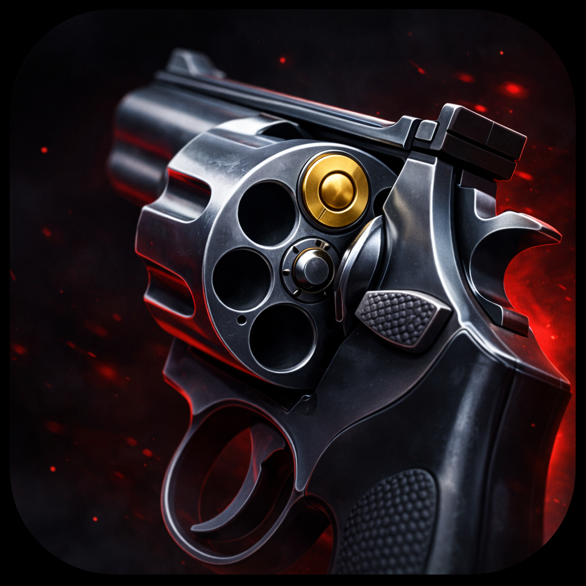

  

  <i>Refusal is not an option.</i>

# Six Ways To Suffer

You awaken in a darkest void. Before you stands a table, behind which looms a dark, sinister silhouette — a creature that devours all light. The Dealer. It forces you into a twisted game. Refusal is not an option. The cold metal revolver clinks onto the table...

This game inspired by Buckshot Roulette with a twist: you load the chambers yourself, each bullet carrying a unique, ominous curse.

This project was developed as part of the 100Devs community challenge. Join us on [Discord](https://discord.gg/UHN4AjMw4d).

You can play it on [itch](https://100devs.itch.io/six-ways-to-suffer).

https://github.com/user-attachments/assets/f354344e-37d0-4678-b1fe-2af23feea4fc

## Rules of Engagement

1. The Dealer agrees to release the subject only if they accumulate a total of 999 dollars (or equivalent) by playing the game designed by the Dealer, effectively "earning" this amount.

2. The Dealer compensates the subject for every bullet they load into the revolver. Certain bullets with unique or rare properties command particularly high payments, suggesting the Dealer's interest in the bullet's effects.

3. The subject must load the revolver and fire, choosing any target for the shot. However, the Dealer offers higher compensation if the subject shoots themselves.

4. After each trigger pull, all remaining loaded bullets become inert and must be immediately discarded. If the subject fails to rid themselves of these bullets, the Dealer will forcibly terminate the session.

5. The subject maintains full autonomy to load any ammunition available in their inventory, including specially acquired rounds. 

6. The Dealer provides access to a dispensing device (hereafter "The Machine"), from which new ammunition types can be purchased. The Machine is a slot machine with a random set of rewards.

7. Should the subject deplete all ammunition and reach bankruptcy (zero dollars), the Dealer forcibly terminates the session.

## License

This project is dual-licensed:
- [CC BY-NC-SA 4.0](./src/assets/LICENSE) for all assets
- [MIT](./LICENSE) for everything else
